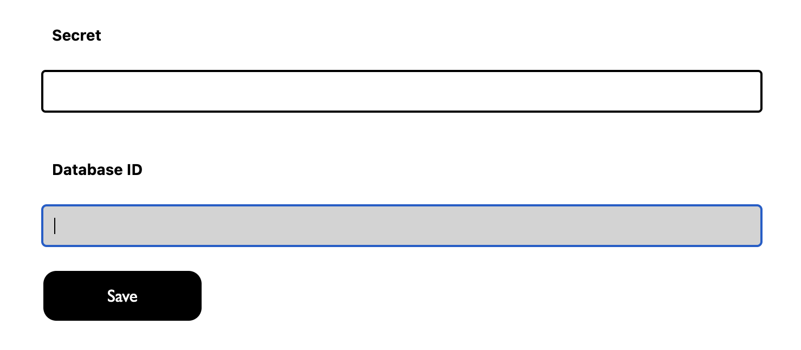
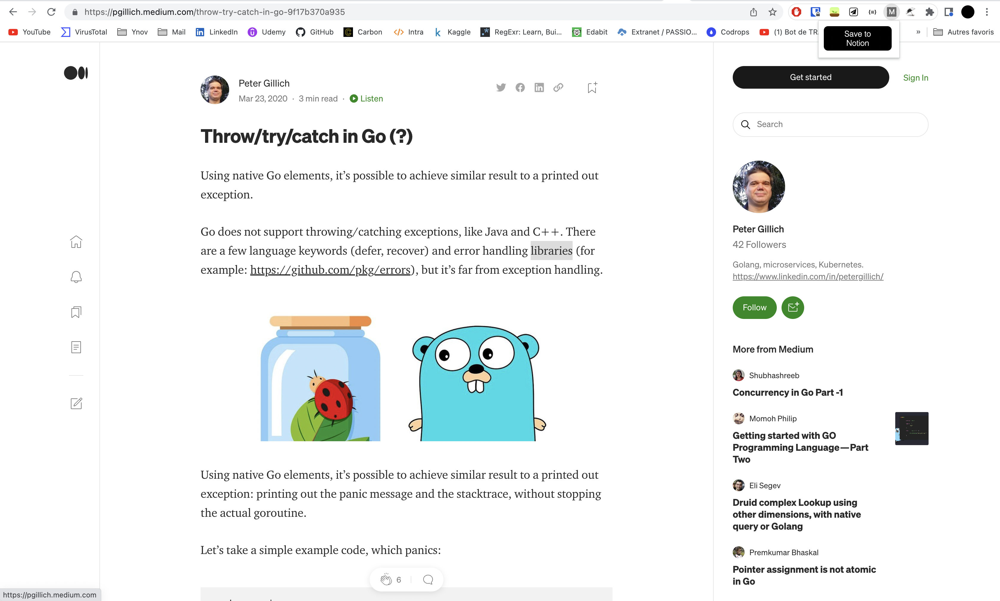
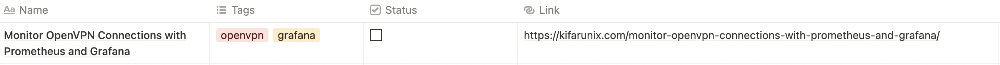

# MediumSaveToNotion

## Chrome extension who safe medium article to notion database

### Create Notion Integrations

First click on [link](https://www.notion.so/my-integrations/) to access to notion integrations page. Create integration with **insert content** activated. After that copy the **Internal Integration Token**. That is the secret on options.

Now add your integration on your notion page : Share > Invite > select your integration

Database ID:
Select your base ID and copy link. It should look like this <https://www.notion.so/user/11a27ZIZOZ19af50acc6a9e3?v=c828329023029e934b0ac3267>

Your database id is **11a27ZIZOZ19af50acc6a9e3**

Go on chrome extension options :

Enter your secret and you Database ID

## Save article

Now you can save an article on medium

# WARNING

Your database need to have this model :

